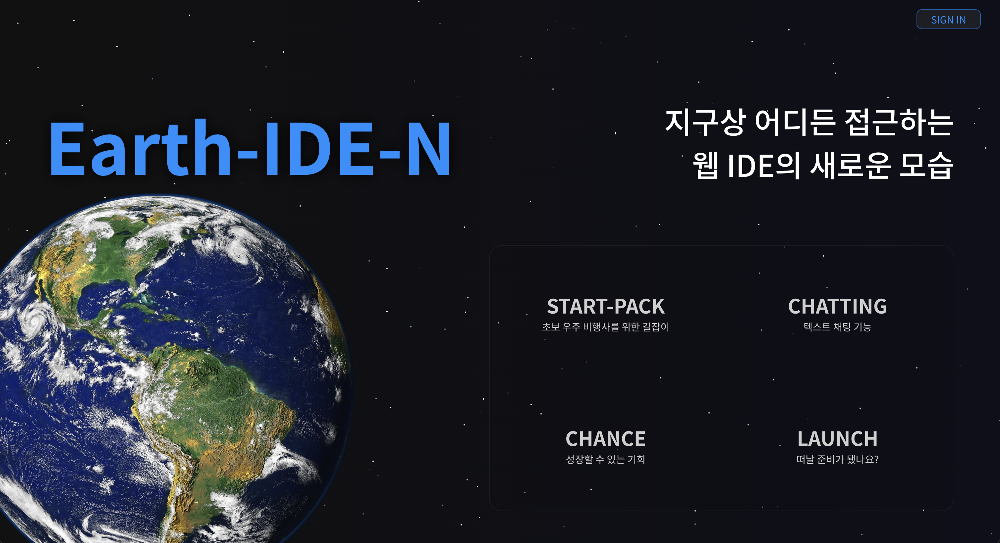
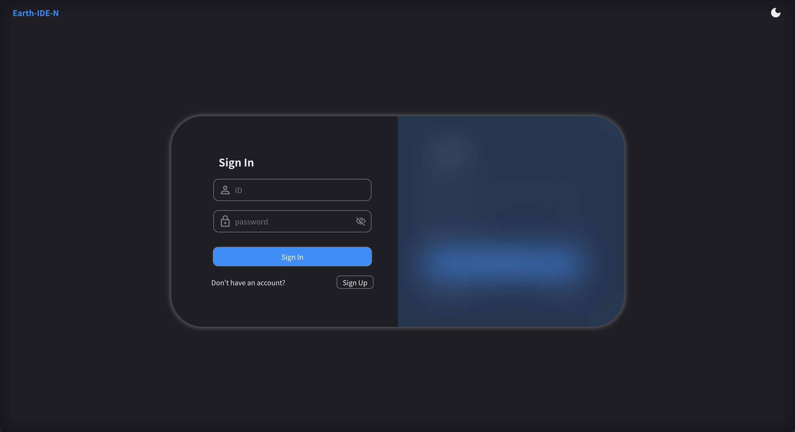
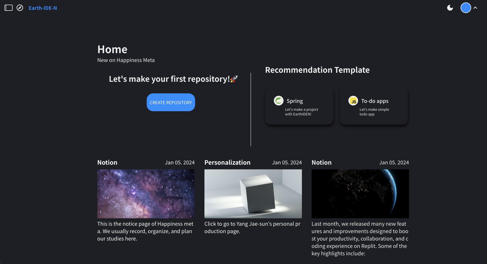
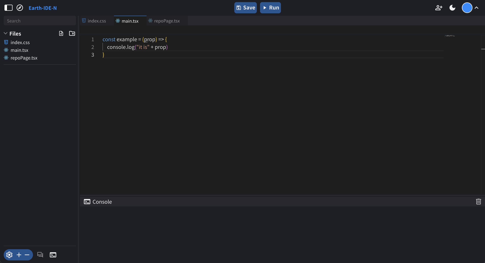
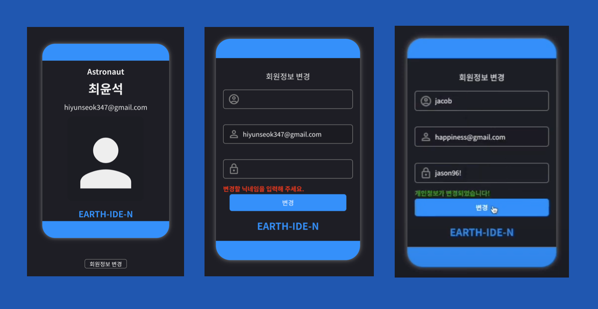

# Earth-IDE-N

웹 기반 통합개발 환경 서비스

## 🙇 프로젝트 소개

초보자를 위한 웹 기반 통합개발 환경 서비스입니다.

## ⏱️ 개발 기간

- 2024.01.28 ~ 2024.02.28 (32일)

## 👨 구성 인원

- 최윤석
  - 역할 : UI/UX Design, 홈페이지, 로그인/회원가입, 파일트리/파일탭/코드에디터/터미널, 개인정보 수정
- 김수연
  - 역할 : 레포지토리, 채팅

## ⚙️ 기술 스택

- React, vite
- TypeScript
- SCSS
- Zustand
- React-query

## 📍 주요 기능

### 1️⃣ 홈페이지

처음에 지구와 설명이 나타나는 홈페이지입니다. 상단 버튼을 통해 로그인 페이지 이동 및 로그아웃이 가능합니다.

### 2️⃣ 로그인/회원가입 페이지

중앙 컴포넌트의 왼쪽은 로그인, 오른쪽은 회원가입 섹션으로 각 하단의 버튼을 통해 가림막을 움직이게 구현하였습니다. 회원가입 시 자동으로 가림막이 오른쪽으로 이동하고, 로그인 성공 시 자동으로 레포지토리 페이지로 라우팅됩니다.

### 3️⃣ 레포지토리 페이지

새 레포지토리를 생성할 수 있고 만들어진 템플릿으로 코드를 이해하며 공부할 수 있게 만든 레포지토리를 구현하였습니다.

### 4️⃣ 코드에디터 페이지

디렉토리, 파일 CRUD, 및 코드 저장 및 실행(자바만 가능)이 되게 구현하였습니다. 또한 각 위치한 버튼들을 통해 섹션을 숨길 수 있거나 경계선을 클릭 및 드래그를 통해 사용자가 섹션의 크기를 조절할 수 있게 구현하였습니다.

### 5️⃣ 회원정보 수정 페이지

본 이미지는 페이지 중 중간에 있는 섹션입니다. 처음에 직원카드 디자인으로 본 서비스의 소속감을 주었고 아래 버튼 클릭 시 카드가 뒤집어져 회원 정보를 수정할 수 있게 구현하였습니다. 수정 성공 시 자동으로 다시 앞면으로 카드가 뒤집어 집니다.

